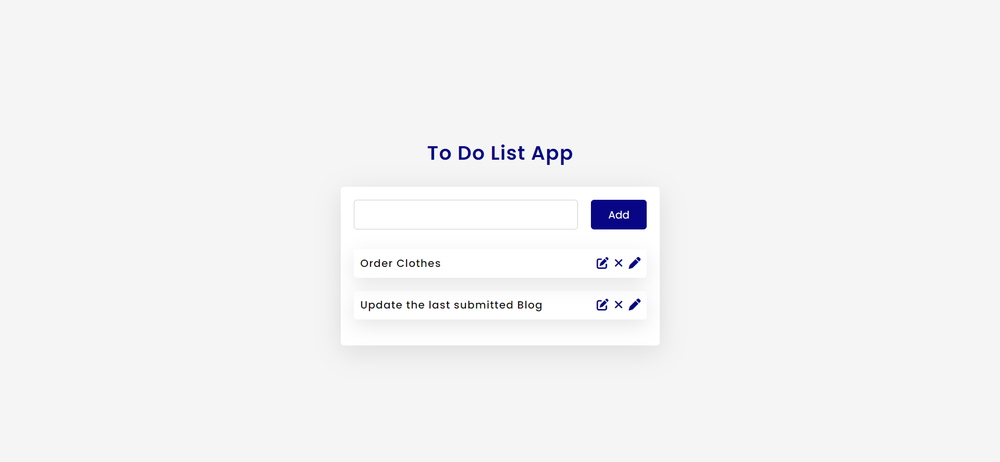

# To Do List:

This repository contains the source code of a simple web application developed using HTML, CSS and Javascript which can be used to create new notes, update and delete them as well.



## Instructions:

1. Get the source code on your pc via git.

```shell
  git clone https://github.com/muskanmi/To-do-list
```

2.  Navigate inside the required folder through your terminal.

```shell
  cd To-do-list/html
```

3. Now, simply open the `index.html` file to access the application on your browser.
